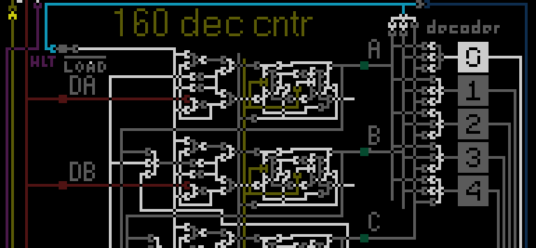

# Введение

Низкоуровневую работу микропроцессора визуально мы будем описывать с помощью простейшего клеточного автомата ([википедия](https://ru.wikipedia.org/wiki/Клеточный_автомат)), визуально оформленного обычной картинкой. То есть каждый пиксель (возможно, увеличенный) на экране - это "клетка". После чего итеративно применяем некоторые правила (описаны далее) ко всем клеткам одновременно. И выводим итоговую картинку на экран.

Для примера, увеличенный кусочек нашего микропроцессора (часть счетчика с десятичным декодером):


Каждая клетка (пиксель) может считаться либо проводником (когда окрашена), либо "физически отсутствовать". Мы будем окрашивать клетки в разные цвета только ради удобства визуального восприятия, но для нашего автомата они все будут совершенно равнозначны. Есть цвет - проводник. Нету цвета (черный) - не проводник.

Вы можете думать о любой цветной клетке как о медном квадратике на печатной плате со слегка скругленными углами (почему - дальше), который сверху покрыли цветным лаком.


Так как примеров у нас будет довольно много, а кроме того их надо будет показывать в динамике, мы будем описывать наши схемы с помощью похожего на xpm формата, который с помощью js будет конвертироваться в картинку. Вот так:
```layout
:o white
+--------------------+
|                    |
| oooooooooooooooooo |
|                    |
+--------------------+
```

И, само собой, как любой проводник клетка может быть "под напряжением". Если к этому квадратику с какой-либо стороны подвести ток, то он его будет через себя проводить. А если не подвести, то не будет.  
Клетки "под напряжением" мы будем выделять более ярким цветом.

Текст на картинке - это тоже проводники. Просто они никуда не подсоединены и поэтому ничего никуда не проводят. Мы их используем не по назначению, мы из них создаем надписи (тоже, кстати, как на реальных платах и кристаллах). Так же как и, наоборот, вырезанные дырочки в целых площадках из проводников.

[Дальше](rules.html)
