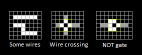

# Правила


Правил у нас всего три. Это:

1. Соседние окрашенные клетки являются частью одной и той же проводящей дорожки *(напоминаю, вне зависимости от их цвета)*.

1. Пересечение двух дорожек через неокрашенную клетку является пересечением двух дорожек *(тоже не зависит от цвета)*.

1. Специальный паттерн (*указатель*, *домик*) во всех своих четырех вращениях является вентилем NOT (*НЕ*).

А теперь детальнее.

## Дорожка

Проводящие клетки собираются в дорожку только по вертикали и горизонтали. Думайте о них как о клетках со скругленными углами, поэтому по диагонали между ними контакта нет. А бок к боку - есть.
Последний раз повторюсь, что цвет каждой клетки совершенно не важен, можно использовать любой (хотя мы и будем стараться избегать смешивания цветов).

Три различны проводника:
{: .ui .pointing .below .label}
```layout
:x white
+------------------------+
|                        |
|  xxxxxxxxxxxxxxxxxxx   |
|                        |
|   xxxx  xxxx    xxxx   |
|      xxxx  xxxxxx      |
|                 x  x   |
|                 x  x   |
|   xxxxxxxxxxx   xxxx   |
|   xxxxxxxxxxx   x  x   |
|   xxxxxxxxxxx   x  x   |
|                        |
+------------------------+
```

* ровный горизонтальный,
* глупый извилистый,
* целая контактная площадка,

## Пересечение двух дорожек

Так как у нас не 3D, то мы используем специальный паттерн пересечения, с дыркой посередине. Это антианалог схемотехнической точки.

Нету посередине дырки - у нас один и тот же проводник из двух соединенных дорожек. Есть посередине дырка - у нас две независимые дорожки (а не четыре!). 

В особо сложных или важных случаях нам помогут не запутаться цвета.  
```layout
:o orange :$ white :O yellow
:@ magenta :# cyan
+------------------------------------------------------------+
|                        O   @                        $ $    |
|            $$$$$$$$$$$$ $$$ $$$$$$$$$$$$$$$$$$$$$$$$$ $    |
|            $           O   @                          $    |
|            $  $$$$$$$$$ $$$ $$$$$$$$$$$$$$$$$$$$$$$$$$$    |
|            $  $        O   @                               |
|            $  $  ###### ### ###############################|
|            $  $  #     O   @                               |
|            $  $  #  ooo ooo ooooooooooooooooooooooooooooooo|
|            $  $  #  o  O   @                               |
|            $  $  #  o  O   @                               |
|            $  $  #  o  O   @                               |
|            $  $  #  o  O   @                               |
|            $  $  #  o  O   @                               |
|            $  $  #  o  O   @                               |
|            $  $  #  o  O   @                               |
|            $  $  #  o  O   @                               |
|            $  $  #  o  O   @                               |
|            $  $  #  o  O   @@@@@@@@@@@@@@@@@@@@@@@@@@@@@@@@|
|            $  $  #  o  O                                   |
|            $  $  #  o  O                                   |
|$$$$$$$$$$$$ $$ $$ $$ $$ $$$$$$$$$$$$$$$$$$$$$$$$$$$$$$$$$$$|
|            $  $  #  o  O                $                  |
|            $  $  #  o  O                $                  |
|$$$$$$$$$$$$ $$ $$ $$ $$ $$$$$$$$$$$$$$$$ $$$$$$$$$$$$$$$$$$|
|            $  $  #  o  O              $ $                  |
|            $  $  #  o  O              $ $                  |
|$$$$$$$$$$$$ $$ $$ $$ $$ $$$$$$$$$$$$$$ $ $$$$$$$$$$$$$$$$$$|
|            $  $  #  o  O            $ $ $                  |
|            $  $  #  o  O            $ $ $                  |
|$$$$$$$$$$$$ $$ $$ $$ $$ $$$$$$$$$$$$ $ $ $$$$$$$$$$$$$$$$$$|
|            $  $  #  o  O          $ $ $ $                  |
|            $  $  #  o  O          $ $ $ $                  |
|            $  $  #  o  O          $ $ $ $                  |
+------------------------------------------------------------+
```

## Специальный паттерн NOT

Это паттерн (домик, стрелочка), который на выход (крышу, кончик) выдает инвертированный сигнал. Если домик под напряжением, то крыша - нет. Если домик не под напряжением, то крыша снова наоборот, бьется.

Для снятия вопроса "откуда там может взяться напряжение, если его вокруг нигде нету" представьте себе, что к каждому вентилю сверху или снизу подведен отдельный проводок с питанием, а внутри у него замкнутый на сам домик соленоид, который этот проводок отнимает от крыши, если на соленоид подать ток. И отпускает к крыше, если не подать.

## В динамике


